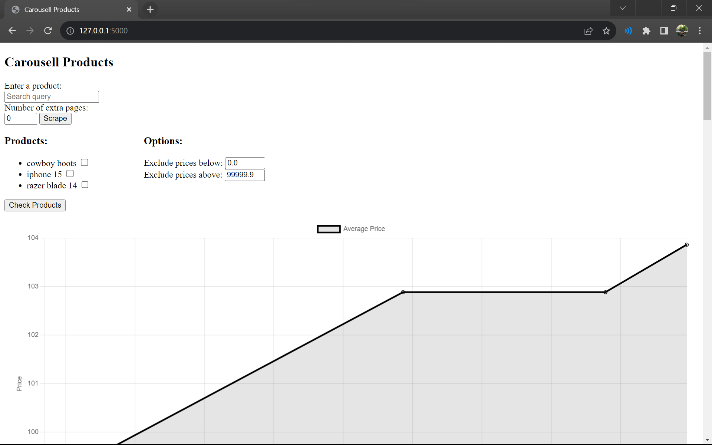
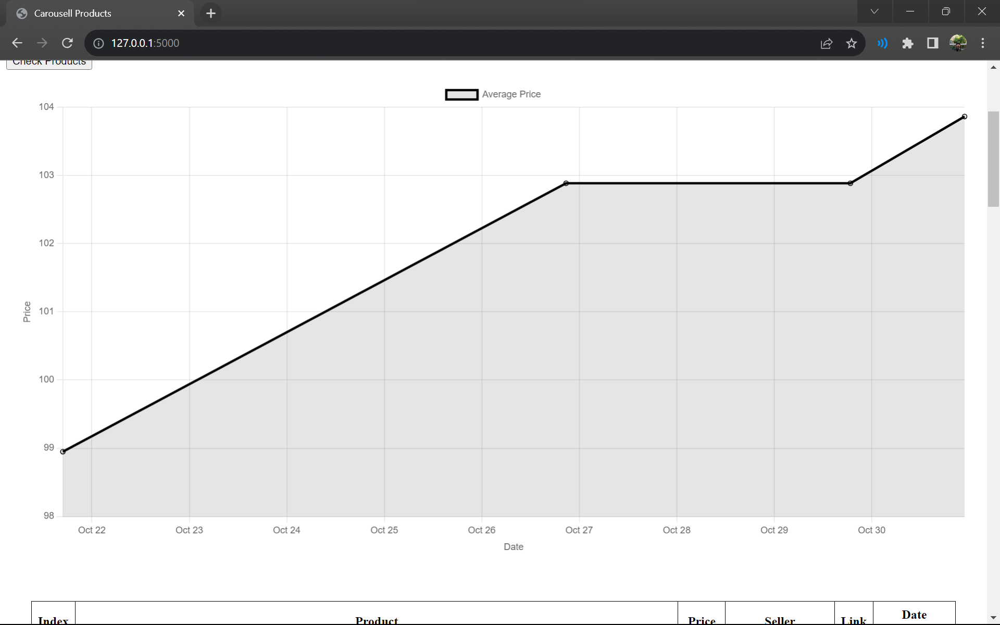
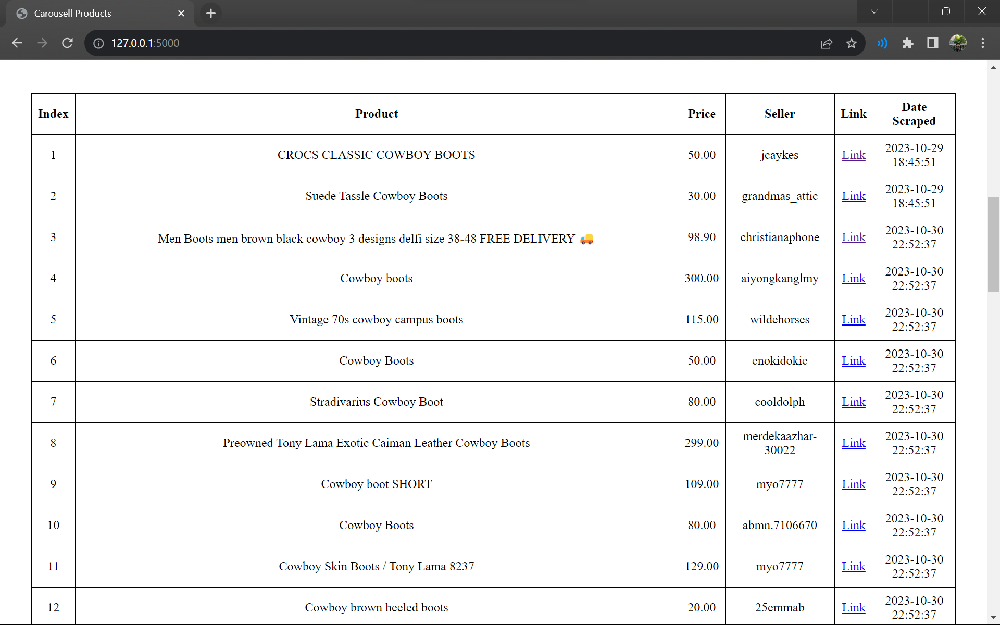
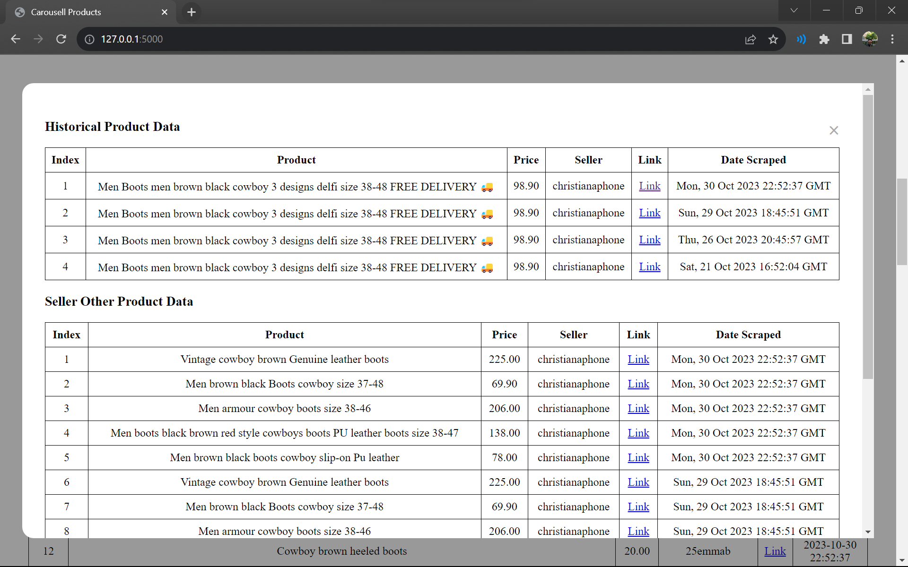

# Web Scraper
This is a web app which activates an automated script that scrapes data off the popular e-commerce website Carousell.

## Features:
* Framework: [Flask](https://flask.palletsprojects.com/en/3.0.x/)
* Database: [MySQL](https://dev.mysql.com/doc/)
* Web Driver: [Undetected Chromedriver](https://pypi.org/project/undetected-chromedriver/2.1.1/)
* Browser Automation: [Selenium](https://www.selenium.dev/documentation/)
* HTML Parsing: [BeautifulSoup4](https://pypi.org/project/beautifulsoup4/)

## Overview:
This web scraper was built with the purpose of tracking the prices of products on Carousell over time.

### Description:
The user can enter a search query which will activate the script which will automatically navigate through the Carousell website to grab product titles, prices, sellers, links and the date and time. The user can also choose how many additional pages to scrape by adding a number to the "Number of extra pages" input field. The data collected will then be stored in the MySQL database. The user can then select a product to check and pick a range of prices to exclude (since people on Carousell like to set their price at $0), and a graph depicting the average price of the product over time will be displayed, as well as as table containing the last version of each product scraped. The user can click on a product, and a popup will appear, showing the price history and any other products (from the same search query) by the seller.

### Screenshots:

| Screenshots | Description |
|-|-|
|  | Where the user can enter a search query to scrape, pick how many additional pages to scrape, select what search query data to display, and QC the results by picking the range of prices to exclude. |
|  | Graph of the average price of all results scraped against the date and time. |
|  | Table containing the data of last version of each product scraped. |
|  | After clicking on an individual product listing, this popup will appear, displaying the historical product data, as well as any other products from this search query by the same seller. |

### Design Choices:
<table>
  <tr>
    <td>Flask</td>
    <td>The decision to use flask was influenced by its integrated unit testing feature which allows for quick debugging, its simplicity and active community support.</td>
  </tr>
  <tr>
    <td>MySQL</td>
    <td>MySQL is a lightweight database management system that allows me to easily visualise all my data and serves the purposes of this project well.</td>
  </tr>
  <tr>
    <td>Selenium</td>
    <td>Selenium is a browser automation tool that allows me to select elements on the web page and interact with them</td>
  </tr>
  <tr>
    <td>Beautiful Soup</td>
    <td>Initially, I was able to obtain the page source but somehow, Selenium was unable to select the data I required from the page. Thus, Beautiful Soup was used and it proved to be more effective at parsing HTML</td>
  </tr>
</table>

### Explaining The Files:
| File | Description |
|-|-|
| script.py | This script is called for in the web app and accepts 2 arguments, the search query, and the number of extra pages. It connects to your MySQL database, opens the Carousell website on incognito, enters and submits the search query, loads the number of extra pages, and grabs the desired data and stores it in the database. It then closes the MySQL connection. |
| app.py | This file is the main flask file which connects to the MySQL database, passes 2 arguments from index.html to script.py to run the script, passes selected products in index.html and the options data to an SQL query to query the database for the desired data, and passes it back to index.html, scripts.js, and graph.js. Also contains function to decode strings. |
| index.html | This file is the frontend of the project, with the inputs and buttons to control the script, options to control the data displayed, the graph of the average price history, the table containing product data, and the popup. |
| scripts.js | Contains logic for how to sort the prices, multiple encode arguments (as flask treats %2f as an unescaped slash, [see here](https://github.com/pallets/flask/issues/900)), logic for the popup. |
| graph.js | Contains logic for the graph, takes the average price for all the products from each scrape and plots it against the time. |
| styles.css | Contains the styles for index.html |

### Packages to install to try:
* Selenium
* Beautiful Soup 4
* Undetected Chromedriver
* MySQL
* Flask

Do remember to add in your MySQL database login details in app.py and script.py.

## Conclusion:

### Challenges encountered:
Initially I found it very difficult to reliably grab data from Carousell's website due to the constantly changing class names. The workaround was using the words in the search query to find elements in the page that contains the words in the search query, this will help find the product titles. However, this by itself is not enough as if the search query was for example, "iphone 15", non product titles with a "15" in them could be selected too. So, I found out that the price element has the same relative position from the product title element for each product, as I was able to use this to my advantage to find both the price, and prevent any non products from being added to the database. This method also has the additional advantage of filtering out any products that were not really related to the search query which carousell likes to add in sometimes. By using the same method to find the price, I also was able to obtain the link and the seller's username.

To prevent detection of my web scraper, I used undetected chromedriver which supposedly does not trigger anti-bot services unlike selenium's webdriver, I used incognito mode, and I also used randomised waits and navigated the Carousell page, entering the search and clicking on the search button, to more closely mimic human behavior.

As mentioned before, flask treats %2f as an unescaped slash, and thus, multiple encoding of strings and multiple decoding of strings are required to create an app route in flask, as product titles which contain a slash breaks the app route, causing it's popup to not be able to open.

### Future Improvements:
Obviously an improvement is the ability to grab the product details inside each link, e.g. for shoes get the size, wear, for phones get the storage, colour, etc. I would say the speed of the script could be improved too. Perhaps utilizing Carousell's built in filter could be a possibility as well.
